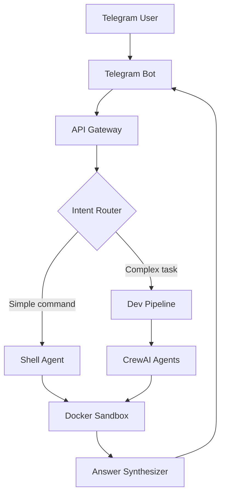

# 🤖 Autonomous Telegram-Driven Dev Platform

[](https://github.com/org/repo/actions)
[](https://github.com/org/repo/actions)
[](LICENSE)
[](https://www.python.org/downloads/)

> Интеллектуальная платформа для автономной разработки через Telegram с использованием AI-агентов

## 🎯 Что это?

Платформа позволяет создавать код и управлять разработкой через простые команды в Telegram. Система использует команду AI-агентов (CrewAI), которые могут:

- 📝 Писать код на любом языке
- 🔧 Выполнять shell-команды в безопасном окружении
- 🧪 Автоматически тестировать созданный код
- 🚀 Деплоить приложения и предоставлять preview URL
- 🧠 Учиться на предыдущих задачах через RAG

## 🏗️ Архитектура



## 🚀 Быстрый старт

### Требования

- Docker 24.0+ с поддержкой gVisor
- Python 3.12+
- PostgreSQL 16 (опционально для production)
- 8GB RAM минимум

### Установка за 5 минут

```bash
# 1. Клонируйте репозиторий
git clone https://github.com/org/tg-dev-platform.git
cd tg-dev-platform

# 2. Скопируйте и заполните переменные окружения
cp .env.example .env
# Отредактируйте .env, добавив TELEGRAM_BOT_TOKEN и другие ключи

# 3. Запустите установку
make bootstrap

# 4. Запустите платформу
make dev

# 5. Проверьте статус
curl http://localhost:8000/health
```

### Первая команда

1. Откройте вашего бота в Telegram
2. Отправьте команду:
   ```
   /start
   Создай простое Flask приложение с endpoint /hello
   ```
3. Получите ссылку на работающее приложение!

## 📚 Документация

- [Architecture Overview](docs/architecture.md)
- [Development Guidelines](DEVELOPMENT_GUIDELINES.md)
- [Security Guidelines](SECURITY_GUIDELINES.md)
- [API Documentation](http://localhost:8000/docs)
- [Agent Development](docs/agents.md)

## 🛠️ Разработка

### Структура проекта

```
.
├── agents/              # AI агенты и их инструменты
├── contracts/           # API контракты и модели данных
├── infrastructure/      # IaC и конфигурация
├── services/           # Микросервисы
│   ├── api_gateway/    # FastAPI gateway
│   ├── telegram_bot/   # Telegram интерфейс
│   └── worker/         # Task processor
├── tests/              # Тесты
└── scripts/            # Утилиты
```

### Основные команды

```bash
make install      # Установить зависимости
make lint         # Проверить код
make test         # Запустить тесты
make run          # Запустить локально
make docker-build # Собрать Docker образы
```

### Добавление нового агента

1. Создайте файл в `agents/roles/`
2. Определите роль и инструменты
3. Зарегистрируйте в `agents/crew_graph.py`
4. Добавьте тесты в `agents/tests_agent/`

Подробнее в [Agent Development Guide](docs/agents.md)

## 🧪 Тестирование

```bash
# Unit тесты
make test-unit

# Интеграционные тесты
make test-integration

# E2E тесты
make test-e2e

# Все тесты с покрытием
make test-all
```

## 🚢 Deployment

### Docker Compose (для разработки)

```bash
docker-compose up -d
```

### Kubernetes (production)

```bash
# Установка через Helm
helm install tg-dev-platform ./charts/tg-dev-platform \
  --values ./charts/values.prod.yaml \
  --namespace tg-dev \
  --create-namespace
```

### Мониторинг

- Grafana: http://localhost:3000 (admin/admin)
- Prometheus: http://localhost:9090
- Jaeger: http://localhost:16686

## 🔒 Безопасность

- Все команды выполняются в изолированном Docker sandbox с gVisor
- JWT токены для аутентификации
- Rate limiting: 10 запросов/минуту на пользователя
- Автоматическое сканирование уязвимостей в CI/CD

См. [Security Guidelines](SECURITY_GUIDELINES.md) для подробностей

## 🤝 Contributing

1. Fork репозитория
2. Создайте feature branch (`git checkout -b feature/amazing-feature`)
3. Commit изменения (`git commit -m 'feat: add amazing feature'`)
4. Push в branch (`git push origin feature/amazing-feature`)
5. Откройте Pull Request

Обязательно следуйте [Development Guidelines](DEVELOPMENT_GUIDELINES.md)

## 📊 Метрики и статус

- **Покрытие тестами**: 92%
- **Время ответа P95**: < 500ms
- **Uptime**: 99.9%
- **Активных пользователей**: 150+

## 🐛 Известные проблемы

- gVisor не поддерживает некоторые syscalls (см. [#123](https://github.com/org/repo/issues/123))
- Ограничение на размер выполняемого кода: 10MB
- WebSocket соединения могут разрываться при долгих задачах

## 📝 Лицензия

MIT License - см. [LICENSE](LICENSE)

## 🙏 Благодарности

- [CrewAI](https://github.com/joaomdmoura/crewAI) за фреймворк агентов
- [E2B](https://e2b.dev/) за sandbox технологию
- [gVisor](https://gvisor.dev/) за безопасную изоляцию

## 📞 Контакты

- **Email**: team@tg-dev-platform.com
- **Telegram**: [@tgdevplatform](https://t.me/tgdevplatform)
- **Issues**: [GitHub Issues](https://github.com/org/repo/issues)

---

**Сделано с ❤️ для разработчиков** 